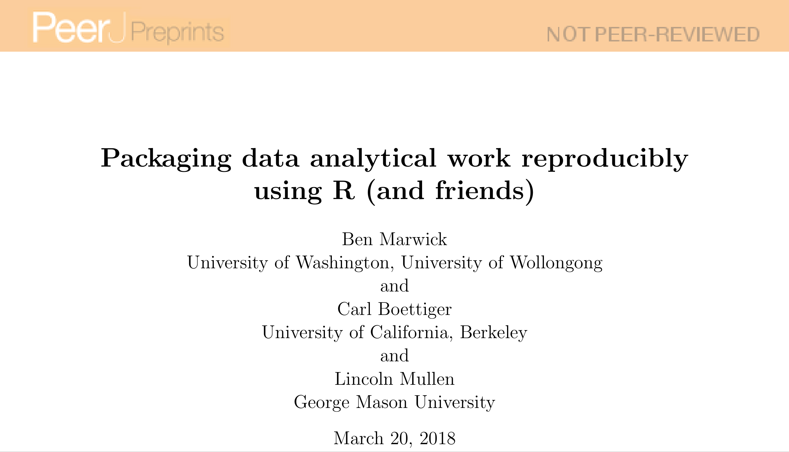

```{r setup, include=FALSE}
knitr::opts_chunk$set(echo = FALSE)
```
# Workshop overview

## Motivation

 for The Turing Way community and is used under a CC-BY licence (DOI [10.5281/zenodo.3332807](10.5281/zenodo.3332807)).](images/reproduciblejourney.jpg){width=50%}

## Two main topics

> - Research compendia
> - R packages

> - Code on github [https://github.com/selinaZitrone/YoMos2020](https://github.com/selinaZitrone/YoMos2020)
> - Slides on [https://selinazitrone.github.io/YoMos2020/index.html](https://selinazitrone.github.io/YoMos2020/index.html)

# Motivations for a better project organization and workflow

> - Reproduciblity 🔃 (for you and others)
> - Reliablity 🏋 (will it work again?)
> - Re-usablity ⚙ (don't re-invent the wheel)
> - Visiblity 🔍 (let others see and use your work)

# How? Use a research compendium!

 for The Turing Way community and is used under a CC-BY licence (DOI [10.5281/zenodo.3332807](10.5281/zenodo.3332807)).](images/ResearchCompendium-ttw.jpg){width=50%}

---

# What *is* a research compendium?

> This is a collection of **all digital parts of a research project** including **data, 
code, texts (protocols, reports, questionnaires, metadata)**. The collection is created 
in such a way that reproducing all results is straight forward.

(Definition from [The Turing Way](https://the-turing-way.netlify.app/afterword/glossary.html#term-Research-Compendia))

[Excursion to the TTW website](https://the-turing-way.netlify.app/research_compendia/research_compendia.html)

[Excursion to Karthik Ram's talk at RStudio::conf 2019](https://inundata.org/talks/rstd19/#/0/3)

---

{width=30%}

* It's an 📦 R Package!
* packages generating similar project directory structures: 
  + rrtools
  + ProjectTemplate
  + prodigenr
  + workflowr  
  
---

{width=100%}

---

# Advantages of using R Packages

* benefit from quality control mechanisms built around R packages (<code>R CMD check</code>)
* easy documentation
* additional packages available to make your life easier
  + [`usethis`](https://usethis.r-lib.org/): workflow package to automate tasks like project setup etc.
  + [`pkgdown`](https://pkgdown.r-lib.org/): build a quick and easy website for your package
  + [`goodpractice`](https://github.com/mangothecat/goodpractice): gives you advice about good
  practices when building R packages
  + [`testthat`](https://testthat.r-lib.org/): add unit testing to your package
  + ... and many more

# Hands-on I 

## Create a research compendium with the R package structure

# Version control

{width=40%}

# Git as a distributed version control system (VCS)

* complete and long-term history of every file in your project
  + go back to specific versions of your project
* collaborate in teams
  + branching and merging
  + tracability: each change is commented and can be traced back to a developer
* host your repository on remote server (GitHub, Bitbucket, GitLab, ...)
  + open-source collaborative development
  + visibility: get new collaborators, feedback, bug reports
  
# Hands-on II

## Add version control to the research compendium

# Automated testing
## What?
> - *unit tests*: functions that run a small amount of code: "units"
> - input: defined and fixed
> - compares output with an expected output
> - returns true/false

## Why?

> - fewer bugs
> - better code (needs to be *testable*)
> - confidence and trust

## How?

> - write tests either before or after implementing your code
> - when you found a bug: before fixing, write a test that would have detected it
> - use a test framework, e.g. in R: [`testthat`](https://testthat.r-lib.org/) package (Hadley Wickham)

# Hands-on III

## Unit tests

# Continous integration (CI)

> "If it hurts, do it more often" (Martin Fowler)


# Continous integration (CI)
## Idea

> - shared code repository (e.g. on github)
> - push code frequently (every day)
> - automated builds and tests after each commit
> - immediate feedback if something doesn't work anymore
> - however, can be time consuming and might be overkill for small or solo projects

# Github Actions for CI (and other automation tasks)

> - supports mac-OS, windows, linux, docker containers
> - integration with github, so no separate setup and authentication
> - free for open source, academic or educational repos
> - 20 concurrent jobs (40 with pro), 6 h per job, 72 h per workflow
> - self host to remove the per job limit
> - very easy to setup with R using the <code>usethis</code> package

 for The Turing Way community and is used under a CC-BY licence (DOI [10.5281/zenodo.3332807](10.5281/zenodo.3332807)).](images/github-actions-with-text.jpg){width=20%}

# Hands-on IV

## Github Actions for `R CMD check`

# Reproducibility and Accessability

[Another excursion to Karthik Ram's talk at RStudio::conf 2019](https://inundata.org/talks/rstd19/#/0/19)

[Holepunch](https://karthik.github.io/holepunch/)

# Hands-on V

## Publish your repository on Binder with a live RStudio server instance
