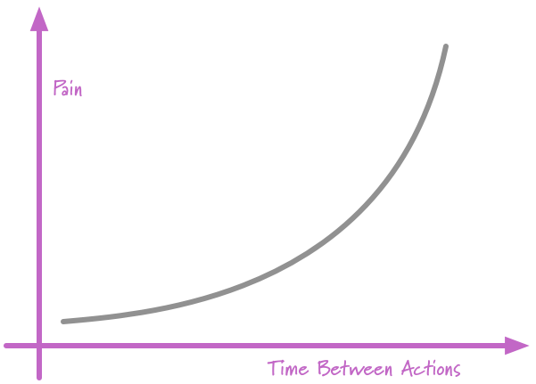

```{r setup, include=FALSE}
options(htmltools.dir.version = FALSE)
knitr::opts_chunk$set(
  fig.width=9, fig.height=3.5, fig.retina=3,
  out.width = "100%",
  cache = FALSE,
  echo = FALSE,
  message = FALSE, 
  warning = FALSE,
  fig.show = TRUE,
  hiline = TRUE
)
```

```{r xaringan-themer, include=FALSE, warning=FALSE}
library(xaringanthemer)
style_mono_accent(
  base_color = "#2369bd",
  header_font_google = google_font("Josefin Sans"),
  text_font_google   = google_font("Montserrat", "300", "300i"),
  code_font_google   = google_font("Fira Mono")
)
```

<style type="text/css">
.large { font-size: 130% }
.small { font-size: 70% }
.tiny{font-size: 40%}
</style>


# Workshop overview

.pull-left[


.left[.small[This image was created by [Scriberia](http://www.scriberia.co.uk/) for The Turing Way community and is used under a CC-BY licence (DOI [10.5281/zenodo.3332807](10.5281/zenodo.3332807)).]]]

--

.pull-right[

### Two main topics

- Research compendia

- R packages

- Code on github [https://github.com/selinaZitrone/YoMos2020](https://github.com/selinaZitrone/YoMos2020)
- Slides on [https://selinazitrone.github.io/YoMos2020/index.html](https://selinazitrone.github.io/YoMos2020/index.html)

]


---

# Motivations for a better project organization and workflow

--

- Reproduciblity 🔃 (for you and others)

--

- Reliablity 🏋 (will it work again?)

--

- Re-usablity ⚙ (don't re-invent the wheel)

--

- Visiblity 🔍 (let others see and use your work)

---

# How? Use a research compendium!

.pull-left[


.left[.small[This image was created by [Scriberia](http://www.scriberia.co.uk/) for The Turing Way community and is used under a CC-BY licence (DOI [10.5281/zenodo.3332807](10.5281/zenodo.3332807)).]]
]

.pull-right[
> This is a collection of **all digital parts of a research project** including **data, 
code, texts (protocols, reports, questionnaires, metadata)**. The collection is created 
in such a way that reproducing all results is straight forward.

(Definition from [The Turing Way](https://the-turing-way.netlify.app/afterword/glossary.html#term-Research-Compendia))<sup>1</sup>

.footnote[
[1] [Excursion to the TTW website](https://the-turing-way.netlify.app/welcome.html)

]
]
---

# What *is* a research compendium?

.pull-left[

### Principles


- stick with the conventions in your field

- Keep **data**, **methods** and **output** separate

- specify the computational environment

]

--

.pull-right[

### Key components

- License

- VCS

- Metadata

- Archive

]

.footnote[
from [Karthik Ram's talk at RStudio::conf 2019](https://inundata.org/talks/rstd19/#/0/3)
]

---


---

# It's an 📦 R Package!

.pull-left[
.center[
]]

--

.pull-right[

- packages generating similar project directory structures: 
  + `rrtools`
  + `ProjectTemplate`
  + `prodigenr`
  + `workflowr`
  
]
  

---

# Advantages of using R Packages

--

* benefit from quality control mechanisms built around R packages (<code>R CMD check</code>)

--

* easy documentation

--

* additional packages available to make your life easier
  + [`usethis`](https://usethis.r-lib.org/): workflow package to automate tasks like project setup etc.
  + [`pkgdown`](https://pkgdown.r-lib.org/): build a quick and easy website for your package
  + [`goodpractice`](https://github.com/mangothecat/goodpractice): gives you advice about good
  practices when building R packages
  + [`testthat`](https://testthat.r-lib.org/): add unit testing to your package
  + ... and many more
  
---
class: inverse
# Hands-on I 

### Create a research compendium with the R package structure

---

# Version control

.center[]

---

# Git as a distributed version control system (VCS)

* complete and long-term history of every file in your project
  + go back to specific versions of your project
* collaborate in teams
  + branching and merging
  + tracability: each change is commented and can be traced back to a developer
* host your repository on remote server (GitHub, Bitbucket, GitLab, ...)
  + open-source collaborative development
  + visibility: get new collaborators, feedback, bug reports
  
---
class: inverse
# Hands-on II

### Add version control to the research compendium

---

# Automated testing

--

#### What?

- *unit tests*: functions that run a small amount of code: "units"
- input: defined and fixed
- compares output with an expected output
- returns true/false

--

#### Why?

- fewer bugs
- better code (needs to be *testable*)
- confidence and trust

--

#### How?

- write tests either before or after implementing your code
- when you found a bug: before fixing, write a test that would have detected it
- use a test framework, e.g. in R: [`testthat`](https://testthat.r-lib.org/) package (Hadley Wickham)

---
class: inverse

# Hands-on III

### Unit tests

---

# Continous integration (CI)

--

.pull-left[
> "If it hurts, do it more often" 
.right[(Martin Fowler)]


]
--
.pull-right[

### Ideas
- shared code repository (e.g. on github)

- push code frequently (every day)

- automated builds and tests after each commit

- immediate feedback if something doesn't work anymore

- however, can be time consuming and might be overkill for small or solo projects
]

---
background-image: url('images/github-actions-with-text.jpg')
background-position: 100% 50%
background-size: 40%

# Github Actions for CI (and other automation tasks)


--

- supports mac-OS, windows, linux, docker containers

--

- integration with github, so no separate setup and authentication

--

- free for open source, academic or educational repos

--

- 20 concurrent jobs (40 with pro), 6 h per job, 72 h per workflow

--

- self host to remove the per job limit

--

- very easy to setup with R using the <code>usethis</code> package

.right[.footer[.small[This image was created by [Scriberia](http://www.scriberia.co.uk/)for The Turing Way community<br>  and is used under a CC-BY licence (DOI [10.5281/zenodo.3332807](10.5281/zenodo.3332807)).]]]

---
class: inverse

# Hands-on IV

### Github Actions for `R CMD check`

---

# Reproducibility and Accessability

[Another excursion to Karthik Ram's talk at RStudio::conf 2019](https://inundata.org/talks/rstd19/#/0/19)

[Holepunch](https://karthik.github.io/holepunch/)

---
class: inverse

# Hands-on V

### Publish your repository on Binder with a live RStudio server instance
